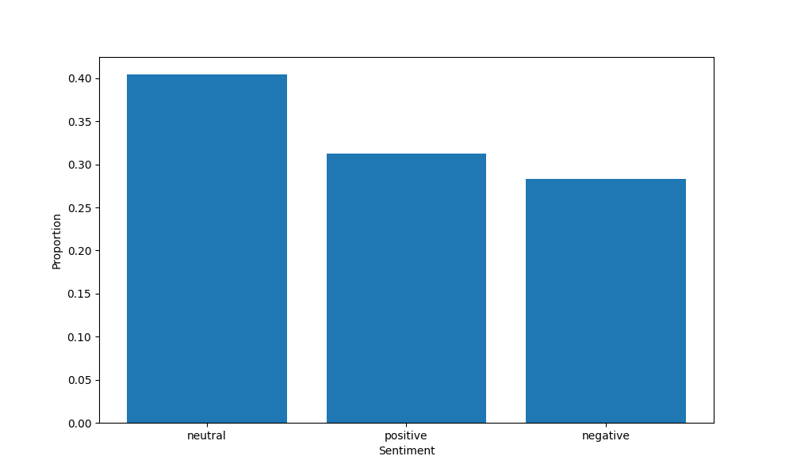
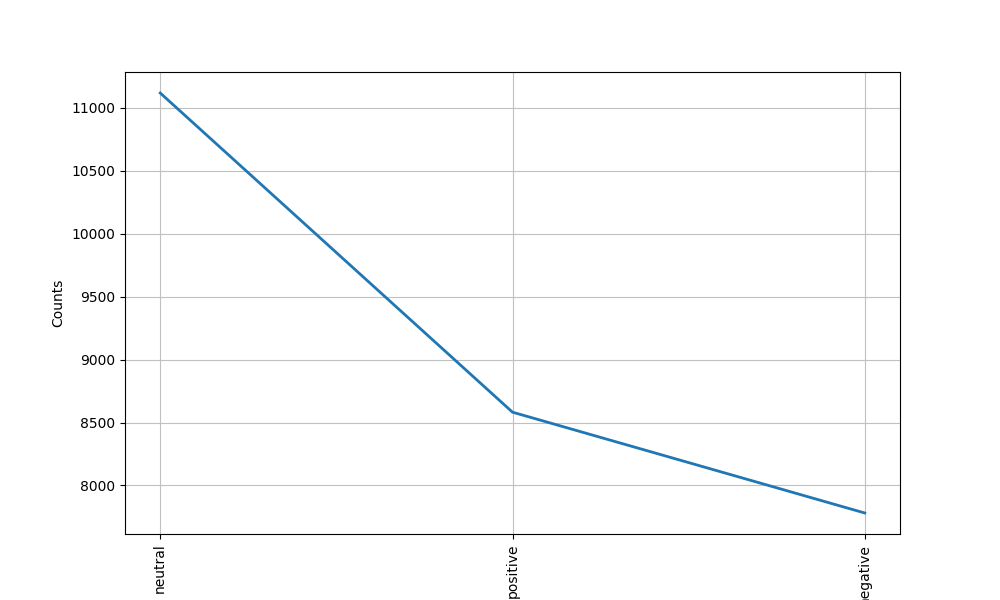
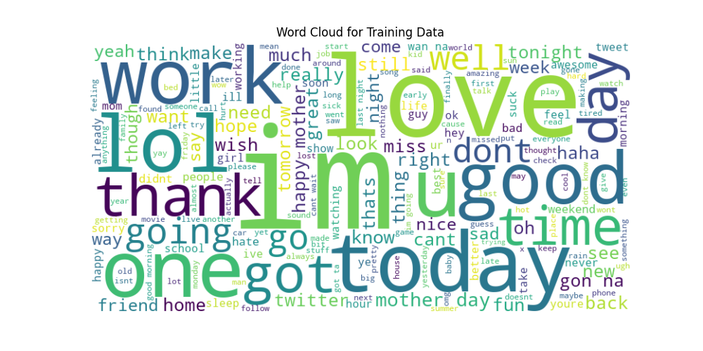
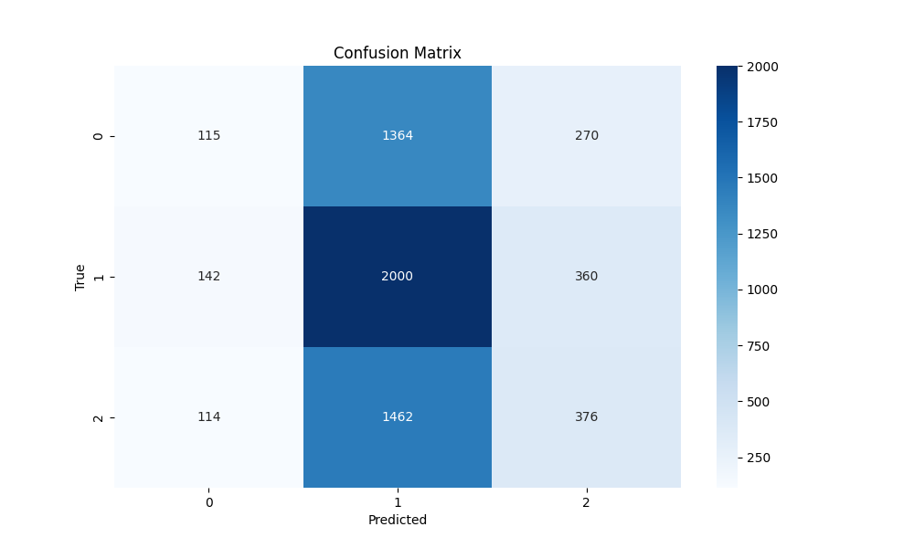
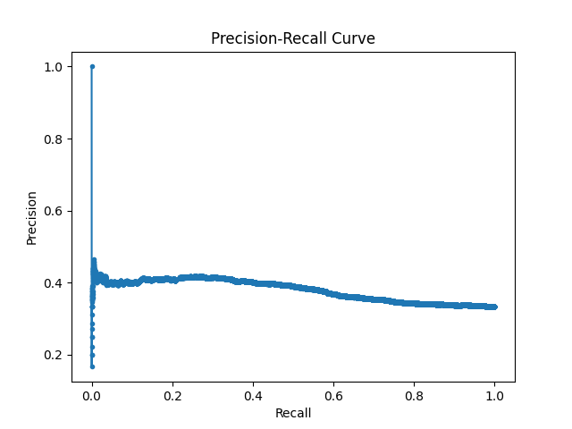

# Sentiment Analysis on Twitter Data

This project focuses on sentiment analysis of Twitter data using various machine learning and deep learning techniques. It covers data preprocessing, model development, hyperparameter optimization, model evaluation, and interpretability.

## Table of Contents
- [Overview](#overview)
- [Installation](#installation)
- [Data Preprocessing](#data-preprocessing)
- [Exploratory Data Analysis (EDA)](#exploratory-data-analysis-eda)
- [Model Development](#model-development)
- [Hyperparameter Optimization](#hyperparameter-optimization)
- [Cross-Validation](#cross-validation)
- [Model Interpretability](#model-interpretability)
- [Model Evaluation](#model-evaluation)
- [Results](#results)

## Overview
This project performs sentiment analysis on a dataset of tweets. The dataset contains information about tweets and their corresponding sentiments. The goal is to classify the sentiment of each tweet into one of the categories: neutral, positive, or negative.

## Installation and Requirements
1. **Python** 3.12.x
2. **Requirements** For all the required libraries and modules refer to the requirements.txt
file or just type this command in your IDE terminal. Make sure to locate this file first<br>
    ``` pip install -r requirements.txt ```

## Data Processing
1. Download the dataset from this <a href="https://www.kaggle.com/datasets/abhi8923shriv/sentiment-analysis-dataset/data?select=train.csv">link</a> and store it a folder name **data**
2. The pre-processing steps include:
    - **Loading the Data** Train and test are loaded from CSV Files
    - **Cleaning the Data** Removing unnecessary columns, lowercasing of texts, removing special character, URLs and stop words
    - **Tokenization and Lemmetization** Text is tokenized the lemmatized for better analysis
        ```python
        def preprocessText(text):
        if not isinstance(text, str):
            return text
        
        #lowercasing
        text = text.lower()
        
        #removing special characters and punctuations
        text = re.sub(r'[^\w\s]', '', text)
        
        #removing URLs
        text = re.sub(r'https?://\S+|www\.\S+', '', text)
        
        # Removing stop-words
        stop_words = set(stopwords.words("english"))
        text = ' '.join([word for word in text.split() if word not in stop_words])
        
        #tokenization
        tokens = word_tokenize(text)
        
        #lemmatization
        lemmatizer = WordNetLemmatizer()
        tokens = [lemmatizer.lemmatize(token) for token in tokens]
        
        return ' '.join(tokens) 

## Exploratory Data Analysis (EDA)
- Visualizations such as sentiment value counts, word frequency distribution, and word clouds are created to understand the data better.

    - **Sentiment Value Counts**<br>
    This visualization helps us to understand the distribuiton of sentiment classes in the dataset. It reveals whether the dataset is balanced or not.

    - **Word Frequency Distribution**<br>
    Based on the word frequencies, we can decide which words to include as features in our model. For instance, we might want to exclude very common words that are not informative.

        ```python
        #Word Frequency Distribution
        wordFreq = FreqDist(word_tokenize(' '.join(trainData['sentiment'])))
        plt.figure(figsize=(10, 6))
        wordFreq.plot(20, cumulative=False)
        plt.title("Word Frequency Distribution")
        plt.xlabel('Word')
        plt.ylabel('Frequency')
        plt.show() 

    - **Word Cloud**<br>
    Word clouds offer a quick and intuitive way to see the most prominent words in the dataset, making it easier to understand the text data at a glance.

- **Visualization Generated from the the EDA**







## Model Development

- **Model Selection**

    - After carefully reviewing the details of various models such as Naive Bayes, Support Vector Machine (SVM), etc., we decided to move forward with a Multi-Layer Perceptron (MLP).

    - Two MLP models with different optimizers were developed and evaluated based on their accuracy, model loss, and training time. Among these, the model with the RMSprop optimizer outperformed the model with the Adam optimizer.

    ```python
    # MLP model with RMSprop Optimizer
    model = Sequential()
    model.add(Dense(128, input_dim=XVTrain.shape[1], activation='relu'))
    model.add(Dense(64, activation='relu'))
    model.add(Dense(yTrainEnc.shape[1], activation='softmax'))

    opt = RMSprop(learning_rate=0.0001)
    model.compile(loss='categorical_crossentropy', optimizer=opt, metrics=['accuracy'])

## HyperParamter Optimization

- This project uses keras-tuner for fine tuning and optimization of the hyperparamter of the selected model

- After the optimization my training time, accuracy and loss went up and provided me with a better insight of my model 

    ```python
    def buildModel(hp):
    model = Sequential()
    model.add(Dense(
        units=hp.Int('units_input', min_value=32, max_value=512, step=32),
        input_dim=XVTrain.shape[1],
        activation=hp.Choice('activation_input', values=['relu', 'tanh', 'sigmoid'])
    ))
    model.add(Dense(
        units=hp.Int('units_hidden', min_value=32, max_value=512, step=32),
        activation=hp.Choice('activation_hidden', values=['relu', 'tanh', 'sigmoid'])
    ))
    model.add(Dense(yTrainEnc.shape[1], activation='softmax'))
    
    optimizer = hp.Choice('optimizer', values=['rmsprop', 'adam', 'sgd'])
    if optimizer == 'rmsprop':
        opt = RMSprop(learning_rate=hp.Choice('learning_rate', values=[1e-2, 1e-3, 1e-4]))
    elif optimizer == 'adam':
        opt = Adam(learning_rate=hp.Choice('learning_rate', values=[1e-2, 1e-3, 1e-4]))
    else:
        opt = SGD(learning_rate=hp.Choice('learning_rate', values=[1e-2, 1e-3, 1e-4]))

    loss = hp.Choice('loss', values=['categorical_crossentropy', 'mean_squared_error'])
    
    model.compile(loss=loss, optimizer=opt, metrics=['accuracy'])
    
    return model

## Model Interpretability

 - For a better explanation and insight, this projects uses the lime module of python to explain individual predictions. 

## Cross-Validation

    - For preventing overfiting of the data and generalization performance of the model, cross validation techinques were implemented. 

# Model Evaluation

- After the above, steps, the model is evaluated using various metrics including accuracy, confusion matrix, precision-recall curves, ROC-AUC

    
    

    ```python 
    # Predictions
    yPred = model.predict(XVTest.toarray())

    # Confusion Matrix
    cm = confusion_matrix(np.argmax(yTestEnc, axis=1), np.argmax(yPred, axis=1))

    # Plotting Confusion Matrix
    plt.figure(figsize=(10, 6))
    sns.heatmap(cm, annot=True, fmt='d', cmap='Blues')
    plt.xlabel('Predicted')
    plt.ylabel('True')
    plt.title('Confusion Matrix')
    plt.show()

## Results

- **Model with Adam Optimizer**

    - **Test Accuracy**: 0.6357
    - **Test Loss**: 2.1005

- **Model with Adam Optimizer**

    - **Test Accuracy**: 0.7116
    - **Test Loss**: 0.8713

- **After Hyperparameter Optimization Cross-Validation**

    - **Average Accuracy**: 0.7070
    - **Average Loss**: 0.8420

- **ROC-AUC Score**: 0.6122
